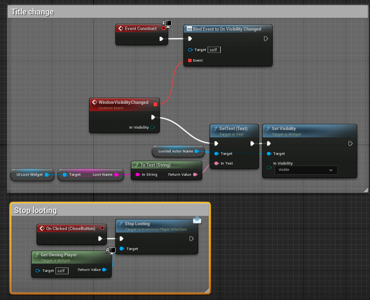
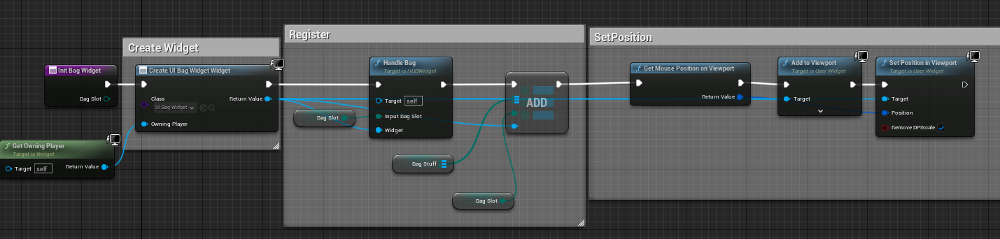
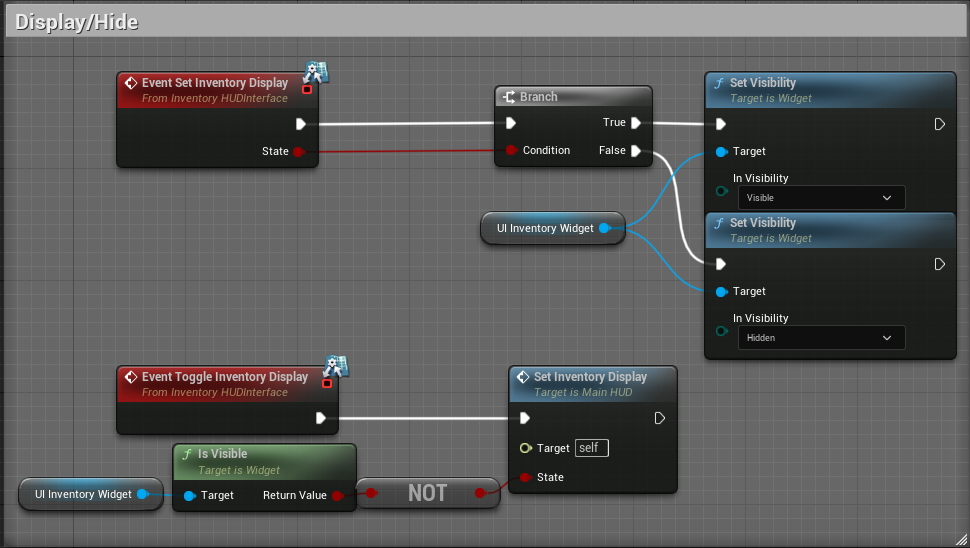
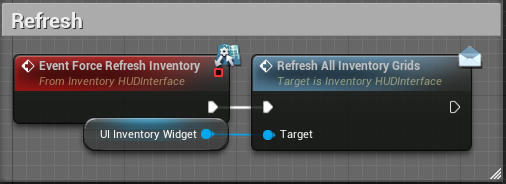
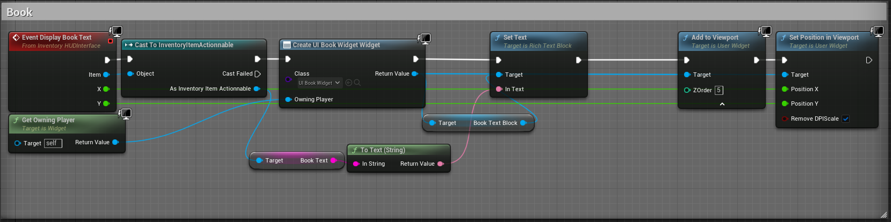
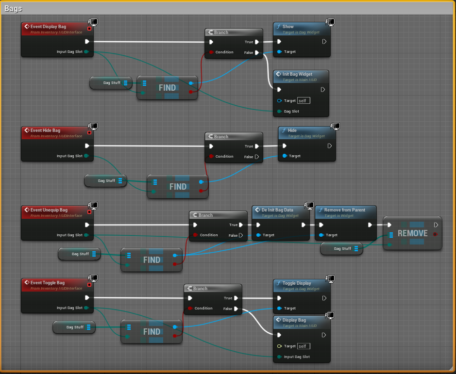
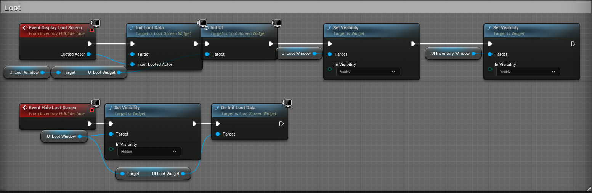

# UE5PluginIntegration
This is the plugin integration demo project for different UE5 plugins

## Extending Components and Interfaces
Interfaces can be extended to retain the same internal mechanism in the plugin, but fit the needs of your specific project.

## Tutorial

Submodule are a great way to include plugins, this is how they are linked to this repo. If your plugin floders are empty, you probably forgot the put --recursive during the clone.

# Multiplayer Chat Plugin

Multiplayer chat plugin is available at https://github.com/Synock/UE5MultiplayerChatPlugin

See its included readme for more details on the general plugin workflow.

Note that in the custom HUD blueprint, the pointer to the chatbox are defined.

## PlayerController implementation of IPlayerChatInterface

See the **_Chat_** section of the APluginIntegrationPlayerController

### General purpose functions
#### **_GetChatName_**
Here for simplicity purpose, we return a string initialized using the object's name.

#### **_IsInGroup_**
Is in group is taking a locally stored GroupId to check wether the player is in a group or not.

#### **_GetChatHUD_**
Simply return the locally stored HUD pointer.

### RPCs

All the needed RPC are redefined purely based on the basic proposed template in the plugin. It does the job well. The only reason why they need to be overriden on the project is because they must be considered RPCs?
* Client_AddChatData
* Client_AddChatDataType
* Server_AreaSpeak
* Server_ShoutSpeak
* Server_OOCSpeak
* Server_GroupSpeak
* Server_RaidSpeak
* Server_GuildSpeak
* Server_AuctionSpeak
* Server_TellSpeak

### Custom functions
A few custom functions have been implemented to make use of the chat plugin and interact with other plugins:

* AddQuestProgressChatData() Display a message when quest progress is logged.
* AddNewQuestChatData() Display a message when a new quest begin.
* AddItemLootNotification() Display a message when an item is looted.
* AddItemRewardNotification() Display a message when an item is rewarded through quest.
* GetMOTD() Display a "Message Of The Day" kind of message.

# Dialog and Quest Plugin

## Summary
This plugin is an old school dialog system based on topic. It is inspired in its look and feel from the dialog system of Morrowind. It also includes a basic quest system, with a simple quest journal.

The two are linked together because of the way quest progression is tied to dialog topics and dialog topics can be tied to quest condition. However, the dialog system is totally standalone and does not need the quest to work as intended.

Its underlying philosophy is to be replicated on a dedicated server environment and keep as much information as possible on the server side.

## Dialog system

There are 2 main interfaces and 2 actor component related to the dialog system. Each go as a pair and we will only consider the actor component, but the key idea is that an actor having the component should also implement the interface. Another interface (IDialogDisplayInterface) is only related to displaying the UI.

### DialogGameModeInterface and DialogMainComponent
This is an actor component and interface that should be implemented by the game mode to handle dialog mastering. The interface is just a getter for the `DialogMainComponent`.

The `DialogMainComponent` contains lookup tables and data for all the dialog topic, bundle and meta bundle. It also contains a set of helper functions to fetch needed data. As this part is intended to be only defined on the GameMode, it is build to exist only on the server side.

During the GameMode initialization, you are expected to fill up the data table regarding the dialog. This was designed to load dialog data from a database upon server launch, but loading from a local data table is also possible.

### DialogComponent and DialogInterface
This actor component/Interface pair is meant to be added to actors that can trigger a dialog. The interface require to redefine a minimal amount of functions, related to relationship of actor toward the player and a simple getter for the component.

See DialogActor in the demo project for a use example.

This component contains the dialog data and the lookup tables concerning one particular actor. This component will be replicated with the actor, embedding all its dialog data.

### DialogDisplayInterface
This interface is meant to handle several signals from the game to reflect on the dialog window. It can be implemented in blueprint and is destined to the player controller.

# Inventory Plugin

## Items database

First thing to do in order to setup the inventory plugin is to define the global item database.

This can be done in two ways depending on your needs.

### GameInstance
If your client ship with the totality of the items infos, or you don't need to able to change items without updating the client, this may be the easiest way.
Make sure your game instance inherit from 

    public IInventoryGameInstanceInterface

### GameMode and GameState
Alternatively, you can put the item database in the GameMode for the server, and replicate it to clients using the GameState.
This is slightly trickier because the GameMode functions has to be able to call the GameState functions to replicate the items registration.

See _APluginIntegrationGameMode::RegisterItem(const FInventoryItem& NewItem)_ for an example.

GameMode should derive from

    public IInventoryGameModeInterface

GameState should derive from 

    public IInventoryGameStateInterface

In any case, you have to redefine the two core functions:

      virtual UInventoryItemBase* FetchItemFromID(int32 ID) override;
      virtual void RegisterItem(UInventoryItemBase* NewItem) override;

From there, item database source will be resolved automatically, starting from the GameInstance if possible then trying GameMode/GameState.
## Character / Controller separation

Characters contains the components and the items, while Controller have the functions to equip/ swap / pay etc...

## Characters

### Base character and equipment component

In the given project, a base character class has been defined. This base character class represent an humanoid actor that is capable of equipping stuff.

It is important that any actor capable of equipping items, derive from *IEquipmentInterface*.

*IEquipmentInterface* is the interface for equipping/removing items, it contains the following pure virtual functions.

    virtual UEquipmentComponent* GetEquipmentComponent() = 0;
    virtual const UEquipmentComponent* GetEquipmentComponentConst() const = 0;

You will need to implement all these functions, but the code given in *ACharacterBase* is sufficient.
You only need to define an *UEquipmentComponent* as one of the character actor component.
This component is initialized in the CharacterBase constructor and is replicated.

You will need to plug calls from *ItemEquipedDispatcher_Server* and *ItemUnEquipedDispatcher_Server* to you equip/unequip function that handle stats changes if any.

This is the place where you should override

    virtual void HandleEquipmentEffect(EEquipmentSlot InSlot, const UInventoryItemEquipable* LocalItem) override;
	virtual void HandleUnEquipmentEffect(EEquipmentSlot InSlot, const UInventoryItemEquipable* LocalItem) override;

to take into account armor changes, or any other equipment related modifier.

As Equipment play a key role for displaying character elements, it should be replicated to all the clients.

### Player Character, Inventory and complex coin management

Based of the *CharacterBase*, the main player character (*PluginIntegrationCharacter*) is extending its capabilities by adding inventory management and coin handling capabilities.
For this purpose, this class derive from :

    public ACharacterBase, public IInventoryInterface, public IPurseInterface

#### IInventoryInterface & UInventoryComponent

The interface is very simple and only require two pure virtual override.

    virtual UInventoryComponent* GetInventoryComponent() = 0;
	virtual const UInventoryComponent* GetInventoryComponentConst() const = 0;

These functions only send back the *UInventoryComponent*. All other Interface functions make use of these two functions, or internal functions can be accessed through these two.
See *APluginIntegrationCharacter* for an example.
Note that this component possess a *FullInventoryDispatcher_Server* delegate that is used in the example to trigger a server side weight update whenever inventory is modified.

#### IPurseInterface & UCoinComponent

The interface is also very simple and only require two pure virtual override.

    virtual UCoinComponent* GetPurseComponent() = 0;
	virtual const UCoinComponent* GetPurseComponentConst() const = 0;

These functions only send back the *UCoinComponent*  All other Interface functions make use of these two functions, or internal functions can be accessed through these two.
See *APluginIntegrationCharacter* for an example.
Note that this component possess a *PurseDispatcher_Server* delegate that is used in the example to trigger a server side weight update whenever the coin amount is modified.

Here these two elements only needs to be replicated to the owner, as only the owning client can know of the inventory and purse content.

## Controller 

IInventoryPlayerInterface is the core of this plugin and contains most of the logic to handle the inventory system.

To help with keeping everything concise, the following function is defined:

 	APluginIntegrationCharacter* GetMainPlayerCharacter() const
	{
		return Cast<APluginIntegrationCharacter>(GetCharacter());
	}

It is defined to allows for a quick access to the APluginIntegrationCharacter previously introduced. This Character ***must have*** the Inventory, Coin and Equipment components.

You will need to redefine a lot of pure virtual functions in order for the inventory to work:

    virtual UInventoryComponent* GetInventoryComponent() = 0;
    virtual const UInventoryComponent* GetInventoryComponentConst() const = 0;

	virtual UCoinComponent* GetCoinComponent() = 0;
	virtual const UCoinComponent* GetCoinComponentConst() const = 0;

	virtual AActor* GetInventoryOwningActor() = 0;
	virtual AActor const* GetInventoryOwningActorConst() const = 0;

	virtual bool GetTransactionBoolean() = 0;
	virtual void SetTransactionBoolean(bool Value) = 0;

	virtual AActor* GetMerchantActor() = 0;
	virtual const AActor* GetMerchantActorConst() const = 0;
	virtual void SetMerchantActor(AActor* Actor) = 0;

	virtual AActor* GetLootedActor() = 0;
	virtual const AActor* GetLootedActorConst() const = 0;
	virtual void SetLootedActor(AActor* Actor) = 0;

	virtual IInventoryHUDInterface* GetInventoryHUDInterface() = 0;
	virtual UObject* GetInventoryHUDObject() = 0;

	virtual UCoinComponent* GetStagingAreaCoin() = 0;
	virtual UStagingAreaComponent* GetStagingAreaItems() = 0;

Most of these functions are straightforwardly implemented and just returns the correct component pointers.

However, the controller is expected to have, one way or another the following variables and systems:

### InventoryHUDInterface Compatible HUD

As with the other plugins, the controller is expected to have knowledge of the player HUD, and this HUD is expected to implement the Interface InventoryHUDInterface.

### Transaction boolean
This is implemented by

     bool TransactionBoolean = false;

It creates a buffer to disallow the user to perform multiple operations before the server is ok with it.
Meaning that while the boolean is at true, the client won't allow the user to perform any inventory related action.

### Staging components

Two staging components are used in order to handle limbo related items states, for instance if the player put items into a trading windows, or a quest giving windows.
One handle the coins and one is specifically designed to handle items.

	UPROPERTY(Replicated, BlueprintReadOnly, Category = "Inventory|Staging")
	TObjectPtr<UCoinComponent> StagingAreaCoin;

	UPROPERTY(Replicated, BlueprintReadOnly, Category = "Inventory|Staging")
	TObjectPtr<UStagingAreaComponent> StagingAreaItems;

### Banking component

If needed, the player controller can handle a bank component, meaning that the player may be able to store items and coins outside of his character and retrieve it at a later moment.

	UPROPERTY(Replicated, BlueprintReadOnly, Category = "Inventory|Bank")
	TObjectPtr<UCoinComponent> BankCoin;

	UPROPERTY(Replicated, BlueprintReadOnly, Category = "Inventory|Bank")
	TObjectPtr<UBankComponent> BankComponent;

### Merchant actor

A pointer toward the currently active merchant actor must be available to handle inventory transactions.

	UPROPERTY(ReplicatedUsing=OnRep_MerchantActor, BlueprintReadOnly, Category = "Inventory|Merchant")
	AActor* MerchantActor = nullptr;

This member variable comes with its own OnRep Function 

 	if (MerchantActor)
	{
		const IMerchantInterface* MerchantInterface = Cast<IMerchantInterface>(MerchantActor);

		UE_LOG(LogTemp, Log, TEXT("OnRep_MerchantActor %s"), *MerchantInterface->GetMerchantName());
		GetInventoryHUDInterface()->Execute_DisplayMerchantScreen(GetInventoryHUDObject(), Cast<AActor>(MerchantActor));
	}
	else
	{
		UE_LOG(LogTemp, Log, TEXT("Clearing Merchant Action"));
		GetInventoryHUDInterface()->Execute_HideMerchantScreen(GetInventoryHUDObject());
	}

This functions perform the very basic action of displaying, hiding the merchant screen on replication.
This mechanism can also be handled differently and the OnRep_ function can be ditched depending on your project.

To handle the transactions themselves you will need to override these RPC functions:
The code provided here should be widely reusable, but you must redefine these functions as interfaces RPC are not working

    //UFUNCTION(Server, Reliable, Category = "Inventory|Merchant")
    virtual void Server_MerchantTrade(AActor* InputMerchantActor) = 0;

	//UFUNCTION(Server, Reliable, Category = "Inventory|Merchant")
	virtual void Server_StopMerchantTrade() = 0;

	//Buy selected stuff from merchant
	//UFUNCTION(Server, Reliable, WithValidation,  Category = "Inventory|Merchant")
	virtual void Server_PlayerBuyFromMerchant(int32 ItemId, const FCoinValue& Price) = 0;

	//Sell selected stuff to merchant
	//UFUNCTION(Server, Reliable, WithValidation, Category = "Inventory|Merchant")
	virtual void Server_PlayerSellToMerchant(EBagSlot OutSlot, int32 ItemId, int32 TopLeft, const FCoinValue& Price) =
	0;

	//UFUNCTION(Server, Reliable, WithValidation, Category = "Neverquest|Inventory")
	virtual void Server_PlayerAutoEquipItem(int32 InTopLeft, EBagSlot InSlot, int32 InItemId) = 0;

### Looted Actor

Similarly to the merchant actor system, the looted actor system expect to be defined this way

    UPROPERTY(ReplicatedUsing=OnRep_LootedActor, BlueprintReadOnly, Category = "Inventory|Loot")
    AActor* LootedActor = nullptr;

with the custom OnRep Function 

    if (LootedActor)
    {
         UE_LOG(LogTemp, Log, TEXT("OnRep_LootedActor %s"), *LootedActor->GetName());
         GetInventoryHUDInterface()->Execute_DisplayLootScreen(GetInventoryHUDObject(), LootedActor);
    }
    else
    {
          UE_LOG(LogTemp, Log, TEXT("Clearing loot action"));
          GetInventoryHUDInterface()->Execute_HideLootScreen(GetInventoryHUDObject());
    }

### Weight computation dispatcher

To handle weight change computation, a custom dispatcher is required, this is defined by adding the following variable.

	UPROPERTY(BlueprintAssignable)
	FOnWeightChanged WeightDispatcher;

You will have to override the function

    virtual FOnWeightChanged& GetWeightChangedDelegate() = 0;

which is a straightforward get:

    virtual FOnWeightChanged& GetWeightChangedDelegate() override {return WeightDispatcher;}
  

### Inventory, equipment and staging RPC

You will also need to define **_a lot_** of RPC to handle inventory item movement and stuff like that.
You can basically totally reuse the code with minimal changes, but again, the fact that we are doing RPC is the source of the problem.

    //UFUNCTION(Server, Reliable, WithValidation, Category = "Inventory")
    virtual void Server_PlayerMoveItem(int32 InTopLeft, EBagSlot InSlot, int32 InItemId, int32 OutTopLeft,
    EBagSlot OutSlot) = 0;

	//UFUNCTION(Server, Reliable, WithValidation, Category = "Inventory|Equipment")
	virtual void Server_PlayerUnequipItem(int32 InTopLeft, EBagSlot InSlot, int32 InItemId, EEquipmentSlot OutSlot) = 0;

	//UFUNCTION(Server, Reliable, WithValidation, Category = "Inventory|Equipment")
	virtual void Server_PlayerEquipItemFromInventory(int32 InItemId, EEquipmentSlot InSlot, int32 OutTopLeft,
	                                                 EBagSlot OutSlot) = 0;

	//UFUNCTION(Server, Reliable, WithValidation, Category = "Inventory|Equipment")
	virtual void Server_PlayerSwapEquipment(int32 DroppedItemId, EEquipmentSlot DroppedInSlot, int32 SwappedItemId,
	                                        EEquipmentSlot DraggedOutSlot) = 0;

	//UFUNCTION(Server, Reliable, WithValidation, Category = "Inventory")
	virtual void Server_TransferCoinTo(UCoinComponent* GivingComponent, UCoinComponent* ReceivingComponent,
		const FCoinValue& RemovedCoinValue, const FCoinValue& AddedCoinValue) = 0;

	//UFUNCTION(Server, Reliable, WithValidation, Category = "Inventory|Staging")
	virtual void Server_CancelStagingArea() = 0;

	//UFUNCTION(Server, Reliable, WithValidation, Category = "Inventory|Staging")
	virtual void Server_TransferStagingToActor(AActor* TargetActor) = 0;

	//UFUNCTION(Server, Reliable, WithValidation, Category = "Inventory|Staging")
	virtual void Server_MoveEquipmentToStagingArea(int32 InItemId, EEquipmentSlot OutSlot) = 0;

	//UFUNCTION(Server, Reliable, WithValidation, Category = "Inventory|Staging")
	virtual void Server_MoveInventoryItemToStagingArea( int32 InItemId, int32 OutTopLeft, EBagSlot OutSlot) = 0;

### Replication

Don't forget to add the GetLifetimeReplicatedProps defined to ensure that needed elements are replicated

    void APluginIntegrationPlayerController::GetLifetimeReplicatedProps(TArray<FLifetimeProperty>& OutLifetimeProps) const
    {
    Super::GetLifetimeReplicatedProps(OutLifetimeProps);
    DOREPLIFETIME_CONDITION(APluginIntegrationPlayerController, LootedActor, COND_OwnerOnly);
    DOREPLIFETIME_CONDITION(APluginIntegrationPlayerController, MerchantActor, COND_OwnerOnly);
    DOREPLIFETIME_CONDITION(APluginIntegrationPlayerController, StagingAreaCoin, COND_OwnerOnly);
    DOREPLIFETIME_CONDITION(APluginIntegrationPlayerController, StagingAreaItems, COND_OwnerOnly);
    DOREPLIFETIME_CONDITION(APluginIntegrationPlayerController, BankComponent, COND_OwnerOnly);
    DOREPLIFETIME_CONDITION(APluginIntegrationPlayerController, BankCoin, COND_OwnerOnly);
    }

## LootableInterfaceExtended

The fact that this is a multi plugin integration project offers a good opportunity to extend some of the inventory interface beyond their original capability.
This is done here by extending the `LootableInterface` by the `LootableInterfaceExtended` class.

This class override the original class `StartLooting(AActor* Looter)` and does things a bit differently.
Instead of just dumping all the coins to the original looter, the chat message is changed and a fair share of coin is given to each group members.

## LootableActor and LootableChest

LootableActor is, as its name suggests, the base class for lootable actors. It extend `ILootableInterfaceExtended` and contains a pool of lootable items and lootable coins.
It also contains two blueprint implementable events `BlueprintableStartLoot` and `BlueprintableStopLoot` that are called during `StartLoot` and `StopLoot` interface classes to allow some blueprint operation to be performed at a small cost.

This class is directly derived from `ALootableActor` and is a small chest containing items and/or coins that can be looted by players.
The initialization of the chest content and appearance is done in its blueprint version.
Its interaction mechanism is quite simple and limited but make use of the ChatPlugin to display infos on players.

## HUD component

The player HUD component is expected to implement InventoryHUDInterface.
This Interface is 100% blueprint implemented, so digging in it is kind of uneasy, **except**

	UFUNCTION(Category = "Inventory")
	virtual void HandleBag(EBagSlot InputBagSlot, class UBagWidget* Widget) = 0;

This function must be implemented and is in charge to handle variable bags lookup and storage.

Some other custom interface UI classes are wrapped to handle specific behavior :

    UBagWindow
    UBookWindow

These classes share the common traits that they are pop on on click, and can be closed.
However, if UBagWindow stay registered as long as the bag exists, UBookWindow is just a one shot window.

### Loot window

A loot window is necessary to handle player looting from loot containers.

This class is actually only defining stuff in blueprint, such as the loot container name display, and most importantly, the close button action.

### Main HUD graph

You will need to define quite a lot of game logic inside your main HUD component.

First to avoid creating data every time a bag is open, a Map <EBagSlot, UBagWindow*> has been created in BP inside the HUD.
This Map will keep record of bag that were previously opened.
To handle everything more smoothly the BP function `InitBagWidget` was added, which initialize bag related widget and store in the the map.

For readability reason, everything related to Inventory/Item management was put in `InventoryGraph` EventGraph.

#### Inventory display/hide

As it may be advisable to not keep the inventory visible at all time, two functions are expected to handle visibility change. A defined visibility and a toggle event.

#### Inventory refresh
Because it's always handy to be able to force the refresh (even if it should be automatic) there's an event that does exactly that.

#### Book display

Book or text containing items display is a bit of a special case.
Event template take the item to display, and its screen coordinates.
First thing this event do is check that the item requested is actually something clickable.
Then the book widget is created and the item specific text is setup just before it is added to the viewport.

#### Bag Functions

Several events must be defined to handle bag display, bag hiding, bag unequiping and bag display toggle. All that taking the widget cache into account.

#### Loot functions

Two events must handle loot screen display and hiding.

The event `Display Loot Screen`, which initialize looting context and display looting window and visibility.

The event `Hide Loot Screen`, which de-initialize the looting context and hide the looting window.

